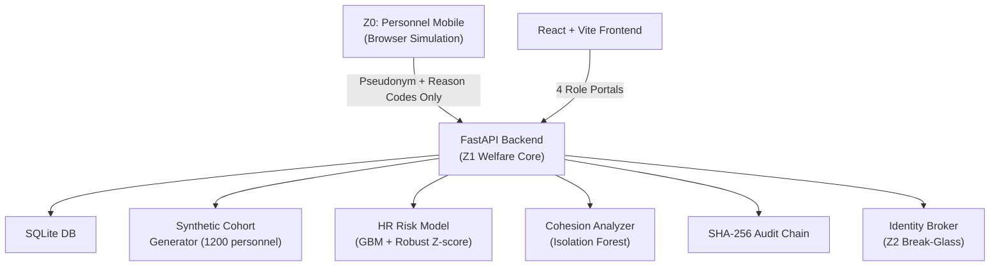

# SAHAYAK — Deep Product & Design Audit Report

> **Audit Date:** September 19, 2026  
> **Auditor Role:** Senior Product Designer, Frontend Architect, Hackathon Evaluator, Technical Reviewer  
> **Scope:** Full-stack analysis against [PS.md](file:///d:/Sahayak/PS.md) problem statement

---

## 1. PROBLEM STATEMENT EXTRACTION

After reading [PS.md](file:///d:/Sahayak/PS.md) in its entirety, here is the structured extraction:

### What exact problem is being solved?
Personnel in CAPFs, Armed Forces, and uniformed services experience **significant mental health deterioration** due to prolonged deployments, separation from families, irregular hours, and traumatic exposure. Current stress identification relies on **manual observation and self-reporting**, which **delays timely intervention**. The system must be **proactive** and **technology-driven**.

### Who are the intended users?
1. **Personnel (Jawans, Constables)** — the monitored population, voluntary self-reporters
2. **Welfare Officers** — primary triage and intervention actors
3. **Commanders** — macro-level workforce planning and readiness
4. **Medical Officers** — clinical support role
5. **Data Protection Officers / Auditors** — compliance verification

### Who is the affected population?
CAPF personnel: BSF, CRPF, ITBP, CISF, SSB, RAF, and Armed Forces. Primarily constables and junior officers deployed in high-stress operational contexts.

### What workflow is the problem statement actually asking for?
1. **Analyze HR indicators** (leave, deployment, duty, transfers, workload)
2. **Support optional self-reporting** via secure mobile application
3. **Incorporate voluntary biometric/wellness data**
4. **Detect behavioral patterns** associated with elevated stress
5. **Generate risk assessments and welfare recommendations**
6. **Enable proactive counseling, welfare interventions, workload balancing**

### What are the required capabilities (Expected Solution)?
| # | Required Capability | 
|---|---|
| 1 | Personnel Wellness Monitoring Dashboard |
| 2 | Mobile-based Wellness and Self-Assessment Application |
| 3 | Predictive Behavioral Analytics Engine |
| 4 | Stress and Burnout Risk Prediction Models |
| 5 | Welfare Intervention Recommendation System |
| 6 | Role-based Access Control and Privacy Management Framework |
| 7 | Automated Alerts for authorized welfare personnel |
| 8 | Data anonymization and secure storage mechanisms |

### What role does AI/ML play?
- **Predictive analytics** for stress/burnout risk
- **Behavioral pattern detection** from HR and wellness data
- **Risk assessment generation** with explainable attributions
- The system is explicitly described as "AI-powered" and "AI-driven predictive analytics"

### What outputs are expected?
- Risk assessments, welfare recommendations, trend identification
- Automated alerts for welfare personnel
- Data-driven welfare planning and resource allocation

### What constraints and challenges are mentioned?
1. Privacy and confidentiality of sensitive personnel data
2. Preventing stigmatization of at-risk personnel
3. Minimizing false positives and false negatives
4. Ethical and transparent AI decision-making
5. Securing sensitive psychological/welfare data against cyber threats
6. Building trust among personnel regarding system usage

### What privacy/security requirements exist?
- Strong privacy safeguards
- Welfare support focus (NOT disciplinary)
- Data anonymization
- Secure storage
- Role-based access control
- Individual dignity and confidentiality
- Data protection compliance (DPDP implied)

### What does a successful solution look like?
A welfare officer logs in, sees flagged personnel with explainable risk scores, understands why they were flagged, takes a concrete intervention action (counseling, duty adjustment, leave approval), and tracks outcomes. The commander sees aggregate readiness without seeing individual identities. Personnel voluntarily self-report and see their own wellness trends, and can access helplines.

---

## 2. COMPLETE PROJECT AUDIT

### Architecture Overview



### Backend Inventory

| Module | File | Purpose | Quality |
|--------|------|---------|---------|
| Main Entry | [main.py](file:///d:/Sahayak/backend/app/main.py) | FastAPI lifespan, router setup, demo seeding | Solid |
| Database | [database.py](file:///d:/Sahayak/backend/app/core/database.py) | SQLAlchemy ORM, case/intervention/audit models | Good |
| Auth | [auth.py](file:///d:/Sahayak/backend/app/core/auth.py) | JWT with PBKDF2, RBAC roles | Good |
| Security | [security.py](file:///d:/Sahayak/backend/app/core/security.py) | Dual-custodian break-glass protocol | Excellent |
| Audit Chain | [audit_chain.py](file:///d:/Sahayak/backend/app/core/audit_chain.py) | SHA-256 hash chain with tamper detection | Excellent |
| K-Anonymity | [k_anonymity.py](file:///d:/Sahayak/backend/app/core/k_anonymity.py) | k≥20 suppression + complementary suppression | Very Good |
| Reason Codes | [reason_codes.py](file:///d:/Sahayak/backend/app/core/reason_codes.py) | Whitelisted reason code catalog | Excellent |
| Synthetic Generator | [synthetic_generator.py](file:///d:/Sahayak/backend/app/ml/synthetic_generator.py) | 1200-person longitudinal synthetic cohort | Very Good |
| HR Risk Model | [hr_risk_model.py](file:///d:/Sahayak/backend/app/ml/hr_risk_model.py) | GBM regressor + unit-relative robust z-scoring | Good |
| Cohesion Analyzer | [cohesion_analyzer.py](file:///d:/Sahayak/backend/app/ml/cohesion_analyzer.py) | Sub-unit anomaly detection | Adequate |
| Welfare API | [welfare_api.py](file:///d:/Sahayak/backend/app/routes/welfare_api.py) | Case CRUD, interventions, weak-label feedback | Good |
| Command API | [command_api.py](file:///d:/Sahayak/backend/app/routes/command_api.py) | Heatmaps, cohesion anomalies, cohort stats | Good |
| Device API | [device_api.py](file:///d:/Sahayak/backend/app/routes/device_api.py) | Escalations, self-referral, erasure | Good |
| Identity API | [identity_api.py](file:///d:/Sahayak/backend/app/routes/identity_api.py) | Break-glass de-anonymization | Good |
| Audit API | [audit_api.py](file:///d:/Sahayak/backend/app/routes/audit_api.py) | Ledger inspection, integrity verification, tamper demo | Good |
| Auth API | [auth_api.py](file:///d:/Sahayak/backend/app/routes/auth_api.py) | Login, role resolution, demo accounts | Adequate |

### Frontend Inventory

| Component | File | Purpose |
|-----------|------|---------|
| AppShell | [AppShell.jsx](file:///d:/Sahayak/frontend/src/components/layout/AppShell.jsx) | Sidebar + header shell, role navigation |
| LoginPortal | [LoginPortal.jsx](file:///d:/Sahayak/frontend/src/components/auth/LoginPortal.jsx) | Role-based login |
| PersonnelWellnessDashboard | [PersonnelWellnessDashboard.jsx](file:///d:/Sahayak/frontend/src/components/device/PersonnelWellnessDashboard.jsx) | Z0 personnel wellness hub |
| DailyCheckIn | [DailyCheckIn.jsx](file:///d:/Sahayak/frontend/src/components/device/DailyCheckIn.jsx) | Mood, sleep, fatigue self-reporting |
| VoiceJournal | [VoiceJournal.jsx](file:///d:/Sahayak/frontend/src/components/device/VoiceJournal.jsx) | Vernacular text/voice diary with on-device NLP |
| LocalAnalytics | [LocalAnalytics.jsx](file:///d:/Sahayak/frontend/src/components/device/LocalAnalytics.jsx) | On-device EWMA trends |
| BuddySupport | [BuddySupport.jsx](file:///d:/Sahayak/frontend/src/components/device/BuddySupport.jsx) | Peer support |
| EmergencyHelpline | [EmergencyHelpline.jsx](file:///d:/Sahayak/frontend/src/components/device/EmergencyHelpline.jsx) | Tele-MANAS 14416 |
| ConsentAndErasure | [ConsentAndErasure.jsx](file:///d:/Sahayak/frontend/src/components/device/ConsentAndErasure.jsx) | DPDP rights |
| CaseList | [CaseList.jsx](file:///d:/Sahayak/frontend/src/components/welfare/CaseList.jsx) | Welfare triage queue |
| CaseDetailModal | [CaseDetailModal.jsx](file:///d:/Sahayak/frontend/src/components/welfare/CaseDetailModal.jsx) | Case investigation modal |
| InterventionLogger | [InterventionLogger.jsx](file:///d:/Sahayak/frontend/src/components/welfare/InterventionLogger.jsx) | Log welfare interventions |
| LabelFeedbackLoop | [LabelFeedbackLoop.jsx](file:///d:/Sahayak/frontend/src/components/welfare/LabelFeedbackLoop.jsx) | Officer model feedback |
| CohortHeatmap | [CohortHeatmap.jsx](file:///d:/Sahayak/frontend/src/components/command/CohortHeatmap.jsx) | Commander fatigue heatmap |
| KAnonDemo | [KAnonDemo.jsx](file:///d:/Sahayak/frontend/src/components/command/KAnonDemo.jsx) | k-Anonymity demonstration |
| CohesionAnomalies | [CohesionAnomalies.jsx](file:///d:/Sahayak/frontend/src/components/command/CohesionAnomalies.jsx) | Climate anomaly alerts |
| RotationAdvisor | [RotationAdvisor.jsx](file:///d:/Sahayak/frontend/src/components/command/RotationAdvisor.jsx) | Stand-down planning |
| HashChainInspector | [HashChainInspector.jsx](file:///d:/Sahayak/frontend/src/components/audit/HashChainInspector.jsx) | Audit ledger inspection |
| ModelComparisonDemo | [ModelComparisonDemo.jsx](file:///d:/Sahayak/frontend/src/components/audit/ModelComparisonDemo.jsx) | Model benchmark |
| ZeroTrustInspector | [ZeroTrustInspector.jsx](file:///d:/Sahayak/frontend/src/components/audit/ZeroTrustInspector.jsx) | Data egress contracts |
| BreakGlassModal | [BreakGlassModal.jsx](file:///d:/Sahayak/frontend/src/components/common/BreakGlassModal.jsx) | Dual-custodian de-anonymization |

### Workflow Trace

**Personnel (Z0) → System → Welfare Officer (Z1):**
1. Personnel submits daily check-in (mood/sleep/fatigue) → stored on-device only
2. Voice/text diary analyzed client-side by lexicon-based NLP → sentiment + distress markers
3. EWMA wellness score computed in browser → local fusion with server-side HR risk band
4. If tier ≥ elevated → escalation payload (pseudonym + reason codes ONLY) → server
5. Server creates `CaseRecord` → written to audit chain → appears in welfare queue
6. Welfare officer sees case in triage list → opens detail modal → sees reason codes + recommended actions
7. Officer logs intervention (counseling/buddy/stand-down/medical leave) → audit chain entry
8. Officer provides weak-label feedback (true_concern/false_alarm) → model calibration signal

**Commander (Z1) → Aggregate Only:**
1. Commander sees unit-level heatmaps → k-anonymity enforced (n≥20)
2. Small cohorts suppressed + complementary suppression active
3. Cohesion anomaly alerts → sub-unit climate friction indicators
4. No access to individual cases or scores

**Auditor:**
1. Inspects SHA-256 hash chain → verifies integrity
2. Can simulate tampering → observe chain alarm
3. Can restore chain

---

## 3. PROBLEM STATEMENT ALIGNMENT

| # | PS.md Requirement | Project Implementation | Evidence | Alignment | Missing/Weak | 
|---|---|---|---|---|---|
| 1 | Analyze HR indicators (leave, deployment, duty, transfers, workload) | GBM model trained on synthetic HR features: consecutive_days_deployed, leave_denial_ratio, night_duty_hours, transfers, duty_variance, promotion_stagnation | [hr_risk_model.py](file:///d:/Sahayak/backend/app/ml/hr_risk_model.py) L16-26, [synthetic_generator.py](file:///d:/Sahayak/backend/app/ml/synthetic_generator.py) L83-120 | **Strongly aligned** | Real HRMS integration is simulated |
| 2 | Optional self-reporting via secure mobile app | DailyCheckIn (mood/sleep/fatigue) + VoiceJournal with vernacular NLP; simulated as browser "mobile frame" | [DailyCheckIn.jsx](file:///d:/Sahayak/frontend/src/components/device/DailyCheckIn.jsx), [VoiceJournal.jsx](file:///d:/Sahayak/frontend/src/components/device/VoiceJournal.jsx) | **Strongly aligned** | No actual mobile app; browser simulation is acceptable for hackathon |
| 3 | Voluntary biometric/wellness data | Sleep hours, mood, fatigue, journal sentiment are captured; no actual biometric sensors | Self-assessment inputs in DailyCheckIn | **Partially aligned** | No wearable/biometric integration; synthetic only |
| 4 | Detect behavioral patterns for stress risk | EWMA trend analysis on-device + GBM risk model server-side + cohesion anomaly detection | [localModel.js](file:///d:/Sahayak/frontend/src/services/localModel.js), [hr_risk_model.py](file:///d:/Sahayak/backend/app/ml/hr_risk_model.py) | **Strongly aligned** | Pattern detection is solid for a prototype |
| 5 | Generate risk assessments and welfare recommendations | Tiered risk (critical/elevated/emerging), whitelisted reason codes with specific recommended actions per code | [reason_codes.py](file:///d:/Sahayak/backend/app/core/reason_codes.py) L18-98 | **Strongly aligned** | Recommendations are static per code; no dynamic/contextual recommendations |
| 6 | Enable proactive counseling, welfare interventions, workload balancing | InterventionLogger supports: peer_buddy_nudge, welfare_counseling, medical_leave, duty_stand_down, family_liaison | [InterventionLogger.jsx](file:///d:/Sahayak/frontend/src/components/welfare/InterventionLogger.jsx), [welfare_api.py](file:///d:/Sahayak/backend/app/routes/welfare_api.py) L122-163 | **Strongly aligned** | Outcome tracking after intervention is weak |
| 7 | Personnel Wellness Monitoring Dashboard | PersonnelWellnessDashboard with check-ins, journal, trends, buddy, SOS | [PersonnelWellnessDashboard.jsx](file:///d:/Sahayak/frontend/src/components/device/PersonnelWellnessDashboard.jsx) | **Strongly aligned** | — |
| 8 | Mobile-based Wellness Application | Simulated in browser; no native mobile build | Browser-only simulation | **Partially aligned** | Acceptable for hackathon demo |
| 9 | Predictive Behavioral Analytics Engine | GBM model + EWMA + local fusion formula | Backend ML pipeline | **Strongly aligned** | No time-series forecasting; current state only |
| 10 | Stress and Burnout Risk Prediction Models | GBM regressor with unit-relative calibration (robust z-score) | [hr_risk_model.py](file:///d:/Sahayak/backend/app/ml/hr_risk_model.py) L32-89 | **Strongly aligned** | Single model; no ensemble or comparison to validated psychological instruments |
| 11 | Welfare Intervention Recommendation System | Each reason code maps to a specific recommended action | [reason_codes.py](file:///d:/Sahayak/backend/app/core/reason_codes.py) | **Partially aligned** | Recommendations are static lookup, not AI-generated or context-sensitive |
| 12 | Role-based Access Control | JWT RBAC with 4 roles: Z0_PERSONNEL, Z1_WELFARE_OFFICER, Z1_COMMANDER, AUDITOR | [auth.py](file:///d:/Sahayak/backend/app/core/auth.py), [auth_api.py](file:///d:/Sahayak/backend/app/routes/auth_api.py) | **Strongly aligned** | — |
| 13 | Automated Alerts for welfare personnel | Cases appear in triage queue automatically on escalation; toast notifications | Escalation flow in device_api → case creation → welfare queue | **Partially aligned** | No push notifications, email, or SMS alerts; no real-time WebSocket |
| 14 | Data anonymization and secure storage | Pseudonym IDs throughout Z1; dual-custodian break-glass for de-anonymization; k-anonymity for aggregates | [security.py](file:///d:/Sahayak/backend/app/core/security.py), [k_anonymity.py](file:///d:/Sahayak/backend/app/core/k_anonymity.py) | **Strongly aligned** | Excellent privacy architecture |
| 15 | Prevent stigmatization | Welfare-only framing; no disciplinary connection; reason codes avoid clinical labels | Design philosophy throughout | **Strongly aligned** | — |
| 16 | Minimize false positives/negatives | Weak-label feedback loop for model calibration; unit-relative calibration prevents wholesale flagging | [LabelFeedbackLoop.jsx](file:///d:/Sahayak/frontend/src/components/welfare/LabelFeedbackLoop.jsx), [welfare_api.py](file:///d:/Sahayak/backend/app/routes/welfare_api.py) L165-195 | **Partially aligned** | Feedback loop exists but model retraining is not implemented |
| 17 | Ethical and transparent AI | Whitelisted reason codes (no free-text), SHAP-style attributions, audit chain | Reason code whitelist + audit chain | **Strongly aligned** | Actual SHAP values not computed; rule-based attribution |
| 18 | Secure against cyber threats | Rate limiting, JWT, hash chain integrity verification, DPDP erasure | [main.py](file:///d:/Sahayak/backend/app/main.py) L102-106, audit chain verification | **Partially aligned** | SQLite in production would be vulnerable; no encryption at rest |
| 19 | Build trust among personnel | On-device processing emphasis, "zero data egress" messaging, consent/erasure controls | Footer, UI messaging, ConsentAndErasure component | **Partially aligned** | Trust-building is communicated but actual on-device processing is simulated |

---

## 4. OVERALL ALIGNMENT SCORE

| Dimension | Score | Reason |
|---|---|---|
| **Problem understanding** | **9/10** | The project demonstrates genuine, deep understanding of the CAPF welfare domain. Deployment contexts (CI, border, public order, static) are realistic. Post-leave hazard curves, leave denial impact, and night shift overload show domain research. |
| **Core problem coverage** | **8/10** | All 8 expected solution components are addressed. HR analysis, self-reporting, risk prediction, interventions, RBAC, privacy, and alerts are all present. Missing: real mobile app, real biometric integration, real-time alerts. |
| **User workflow alignment** | **7/10** | The core triage workflow (flag → inspect → understand → intervene → record) exists. But the current UI makes this workflow harder than necessary. Too many clicks and screens between seeing a case and taking action. |
| **AI/ML relevance** | **7/10** | GBM risk model is trained on relevant features. Unit-relative calibration is genuinely thoughtful. However: it's trained on synthetic data with a known target variable (latent_stress_index), making it somewhat circular. On-device NLP is keyword matching, not actual ML. |
| **Actionability/intervention** | **7/10** | Intervention logging works. Recommended actions are shown per reason code. But: no outcome tracking, no case state progression workflow, no follow-up scheduling. The system identifies but doesn't strongly guide the response. |
| **Frontend/product alignment** | **5/10** | The frontend has the right information but presents it poorly. Too many competing signals, excessive technical jargon, and the "portal switching" paradigm confuses the demo experience. |
| **Technical implementation** | **8/10** | Backend is well-architected. SQLAlchemy models are clean. Audit chain is properly implemented. API design is sensible. Rate limiting is present. The privacy architecture (Z0/Z1/Z2 zones) is genuine and well-thought-out. |
| **Security/privacy alignment** | **8/10** | Dual-custodian break-glass, k-anonymity with complementary suppression, pseudonym isolation, DPDP erasure — these are genuinely strong privacy features. This is one of the project's standout strengths. |
| **Demonstrability** | **6/10** | The demo flow is complex. An evaluator needs to understand Z0/Z1/Z2 zones, switch portals, and navigate multiple sub-sections. The "aha moment" is buried under complexity. |
| **Hackathon/evaluation readiness** | **6/10** | Strong backend, strong privacy story. But the frontend doesn't tell the story well. The evaluator experience needs significant improvement to land the impact in 3-5 minutes. |

### **Final Alignment Score: 7.1 / 10**

The project genuinely understands and addresses the problem statement. The privacy architecture is excellent and the backend is solid. The main weakness is that the frontend doesn't surface the project's genuine strengths effectively enough, and some AI claims are weaker than presented.

---

## 5. DEEP FRONTEND AUDIT

### Information Architecture

**Current structure per role:**

- **Z0 Personnel:** Hero greeting → tab bar → 6 sub-sections (check-in, trends, journal, buddy, SOS, privacy)
- **Z1 Welfare:** Summary stats → filter bar → case list → modal detail view
- **Z1 Commander:** Heatmap → k-anonymity demo → cohesion anomalies → rotation advisor
- **Auditor:** Hash chain inspector → model benchmark → zero-trust inspector

**Problems:**

1. **Too many sub-sections competing for attention** — The Z0 Personnel view has 7 sidebar items AND 6 tab items, creating navigation confusion
2. **The "portal switching" paradigm is confusing for demo** — A hackathon evaluator must understand they need to "switch portals" to see different views. This is architecturally correct (RBAC) but terrible for demonstration
3. **Welfare officer sees summary stats that don't help triage** — "Active monitored: 1200" and "Check-in Completion: 71%" are interesting metrics but they don't help the officer decide which case to handle next
4. **Case detail is in a modal** — This forces the officer to open/close modals repeatedly. Case investigation deserves a full-page view

### Cognitive Load Assessment

> "If I am a welfare officer using this for several hours, does this interface make my work easier or harder?"

**HARDER.** Here's why:

1. The case list shows reason code tags inline that are cryptic without hovering: "Prolonged Deployment (>60 Days)" is readable but takes up horizontal space
2. Every case row contains: tier badge, status badge, case ID, unit context, 2-3 reason tags, acute marker, pseudonym ID (truncated), detection time, and an "Inspect case" button — that's **8-10 distinct pieces of information per row**
3. The summary strip at the top (4 metric cards) competes with the filter bar and the case list. Three different information layers are stacked vertically before you reach a single case
4. Opening a case produces a modal with 3 tabs (SHAP Attribution, Interventions, Model Weak-Labeling) — these are technical labels that a welfare officer would not naturally understand

### Layout Analysis

**Sidebar:**
- Contains role-specific navigation with descriptions for each item — good
- "Switch Portal View" dropdown at the bottom — necessary for demo but confusing
- User card with service number, clearance badge — too much metadata for the sidebar footer

**Header:**
- Shows page title + zone badge + security indicator — adequate but wordy
- "On-Device Private" / "RBAC Guarded" badges are security theater for the evaluator, not useful for the user

**Case queue:**
- Grid layout with 4 columns on desktop: ID+tier | reason codes | pseudonym+time | action button
- Reason codes column takes too much horizontal space with multiple tags
- Pseudonym ID shown prominently is useless to the welfare officer — it's a UUID fragment that has zero meaning

**Case detail modal:**
- Max-width 3xl (768px) is narrow for case investigation
- Tabs labeled "SHAP Attribution" — the welfare officer doesn't know what SHAP is
- Reason code cards show description + recommended action — this is actually the best part of the detail view
- No timeline view showing case progression
- No way to see the person's history across multiple cases

### Component Classification

| Component | Classification | Rationale |
|---|---|---|
| Sidebar navigation | **ESSENTIAL** | Core navigation |
| Header title + zone badge | **USEFUL** | Orientation, but zone badge is excessive |
| "RBAC Guarded" / "On-Device Private" badge | **DISTRACTING** | Security theater; the officer knows they're logged in |
| Airplane mode toggle | **USEFUL** | Demonstrates privacy architecture for demo |
| Summary stats strip (4 metrics) | **REDUNDANT** | "Active monitored: 1200" is not actionable. Should be collapsed or moved |
| Check-in completion % | **SHOULD MOVE TO DETAIL VIEW** | Not relevant to the triage queue |
| Filter bar | **ESSENTIAL** | Tier/unit filtering is core triage UX |
| Search bar | **USEFUL** | Case search |
| Case list rows | **ESSENTIAL** | Core workflow |
| Pseudonym ID display in case row | **DISTRACTING** | A truncated UUID means nothing to any human user |
| Reason code tags inline | **USEFUL** | But too many on one row; should be 1-2 with expandable |
| "Inspect case" button | **ESSENTIAL** | Primary action |
| Case detail modal | **ESSENTIAL** but wrong form factor | Should be a full page, not a modal |
| "SHAP Attribution" tab label | **DISTRACTING** | Technical jargon; rename to "Why was this flagged?" |
| Break-Glass button in case detail | **ESSENTIAL** | Core privacy feature; well-placed |
| Intervention logger | **ESSENTIAL** | Core workflow |
| Weak-label feedback | **USEFUL** | Important for model improvement |
| Portal switcher | **USEFUL for demo** | Confusing for real use; acceptable for hackathon |
| Footer privacy messages | **DISTRACTING** | Decorative; the footer is prime screen real estate wasted on a disclaimer |

---

## 6. AI SLOP DETECTION

### Instance 1: Summary Stats Strip
**AI SLOP RISK: MEDIUM**
- **What it is:** Four big-number cards at the top of the welfare view: "Active monitored: 1200", "Check-in Completion: 71%", "Elevated Fatigue: 3", "Requiring Attention: 1"
- **Why it hurts:** These are generic dashboard metrics that look impressive but don't help triage. The first two numbers (1200, 71%) are about the entire cohort — not the officer's queue. Only "Requiring Attention: 1" is actionable.
- **What a real product would do:** Show only the case queue with a count badge. ServiceNow shows "My Open Items (4)" — that's all you need.

### Instance 2: Zone Badges Everywhere
**AI SLOP RISK: MEDIUM**
- **What it is:** "Z0", "Z1", "Z3" badges in the header. "On-Device Private", "RBAC Guarded" security indicators.
- **Why it hurts:** The user doesn't think in terms of "zones." They think in terms of "my cases." This is architecture jargon leaking into UI.
- **What a real product would do:** The security model is enforced in the backend. The frontend doesn't need to constantly remind the user which zone they're in.

### Instance 3: "SHAP Attribution" Tab
**AI SLOP RISK: HIGH**
- **What it is:** The case detail modal's first tab is labeled "SHAP Attribution" with a sparkle icon.
- **Why it hurts:** A welfare officer has no idea what SHAP is. This tab actually shows useful reason codes with recommended actions — the label undermines the content.
- **What a real product would do:** Label it "Why flagged" or "Risk factors." The content is fine; the label is AI slop.

### Instance 4: "Zero Raw Data Invariant" Banner
**AI SLOP RISK: MEDIUM**  
- **What it is:** A banner inside the case detail: "Zero Raw Data Invariant: Raw journals and continuous mood scores never leave the client device."
- **Why it hurts:** The welfare officer doesn't care about data flow invariants while reviewing a case. This is an architecture note, not a user-facing message.
- **What a real product would do:** This belongs in documentation or a "How it works" tooltip, not front-and-center in the case detail.

### Instance 5: "Model Weak-Labeling" Tab
**AI SLOP RISK: MEDIUM**
- **What it is:** Tab in case detail for officer feedback labeled "Model Weak-Labeling"
- **Why it hurts:** "Weak-labeling" is an ML concept. The officer is simply saying "yes this was a real concern" or "no, false alarm."
- **What a real product would do:** Label it "Your Assessment" or "Confirm/Dismiss." The function is good; the name is AI slop.

### Instance 6: Personnel Dashboard Dark Theme
**AI SLOP RISK: LOW-MEDIUM**
- **What it is:** The Z0 personnel view uses a dark blue theme (#111A2B, #162238) that's been CSS-overridden to light colors. The original code contains dark-theme hardcoded hex colors with `!important` CSS overrides in `index.css` to force them light.
- **Why it hurts:** The CSS override approach (lines 138-148 of [index.css](file:///d:/Sahayak/frontend/src/index.css)) is a hack. The component JSX still says `bg-[#111A2B]` but CSS transforms it to white. This is technical debt and indicates the dark theme was the original AI-generated output.
- **What a real product would do:** Use design tokens consistently from the start.

### Instance 7: "Local INT8 Engine" Badge
**AI SLOP RISK: HIGH**
- **What it is:** The voice journal shows a badge saying "Local INT8 Engine"
- **Why it hurts:** There is no INT8 engine. The NLP is keyword matching against a multilingual lexicon in plain JavaScript. This label implies a quantized neural network, which does not exist.
- **What a real product would do:** Either implement actual on-device ML (ONNX/TFLite) or don't claim INT8 quantization. Currently this is a false claim.

### Instance 8: Footer Privacy Messages
**AI SLOP RISK: LOW**
- **What it is:** Footer showing "Raw Psychological Data Stays On-Device" and "Zero Appraisal / HR Export"
- **Why it hurts:** Footer real estate wasted on compliance messaging. Mildly decorative.
- **What a real product would do:** Put privacy assurances in onboarding, not a persistent footer.

---

## 7. SHOULD THIS BE A DASHBOARD?

**No. The current "dashboard" concept is partially wrong.**

Based on PS.md and the actual user workflows, the application should be a **hybrid case management + triage system**, not a dashboard.

### What it should be:

**For Welfare Officers:** A **triage queue / case management system** — closer to ServiceNow or a healthcare triage console. The primary interaction is: scan queue → pick case → investigate → act → move on.

**For Personnel:** A **wellness self-assessment app** — closer to a health check-in app (like Headspace or PTSD Coach). Simple, calm, focused on voluntary engagement.

**For Commanders:** A **monitoring console** — aggregate health indicators for workforce planning. This IS a dashboard, but a very simple one.

**For Auditors:** A **compliance verification tool** — inspect logs, verify integrity. This is a secondary feature.

The current application tries to be all four things in one interface with a "portal switcher," which makes each view feel incomplete. The welfare officer view is the most critical and should be the primary product. The others are supporting roles.

---

## 8. PRIMARY USER WORKFLOW ANALYSIS

### Ideal Welfare Officer Workflow

```
Officer logs in
  ↓
Sees triage queue sorted by urgency (critical first, then elevated, then emerging)
  ↓ (0 clicks — immediate visibility)
Scans cases — each row shows: severity, unit, key reason, time since detected
  ↓
Clicks on highest priority case
  ↓ (1 click)
Full case investigation page shows:
  - Why this person was flagged (reason codes with plain-language explanations)
  - What the recommended action is
  - Previous interventions (if any)
  - Case timeline
  ↓
Officer decides on intervention
  ↓
Selects intervention type + writes brief notes
  ↓ (2-3 clicks + minimal typing)
Confirms whether this was a genuine concern or false alarm
  ↓ (1 click)
Case moves to "intervention active" state
  ↓
Officer returns to queue to handle next case
```

### Current Implementation vs. Ideal

| Step | Ideal Clicks | Current Implementation | Current Clicks | Gap |
|---|---|---|---|---|
| See triage queue | 0 | Must scroll past 4 summary cards, filter bar, then see cases | 0 but cognitive overload | **Minor** |
| Open case detail | 1 | Click "Inspect case" → modal opens | 1 | **OK** |
| Understand why flagged | 0 | Tab is labeled "SHAP Attribution" → must read cryptic tags | 0 but naming is confusing | **Naming issue** |
| See recommended action | 0 | Each reason code card shows recommended action | 0 | **Good** |
| Log intervention | 2 | Switch to "Interventions" tab → fill form → submit | 3 | **Minor** |
| Provide feedback | 2 | Switch to "Model Weak-Labeling" tab → select label → submit | 3 | **Minor** |
| Return to queue | 1 | Close modal | 1 | **OK** |

**Total clicks for one case:** ~8-10 currently, ~6-7 ideal. Not catastrophic, but the cognitive effort is the real problem — too much jargon, too many competing visual elements.

---

## 9. CASE DETAIL EXPERIENCE AUDIT

Current case detail ([CaseDetailModal.jsx](file:///d:/Sahayak/frontend/src/components/welfare/CaseDetailModal.jsx)):

| Question | Current Answer | Quality |
|---|---|---|
| Why was this person flagged? | Reason codes with descriptions + recommended actions | **Good content, bad label** ("SHAP Attribution") |
| What evidence supports the flag? | Reason code descriptions provide operational context | **Adequate** |
| How severe is it? | Tier badge (critical/elevated/emerging) + h_band | **Good** |
| What changed over time? | **NOT SHOWN** | **Missing** — no temporal view |
| What should the officer do? | Recommended action per reason code | **Good** |
| What intervention options exist? | Intervention logger with 5 types | **Good** |
| What has already happened? | Intervention history tab | **Good** |
| What is the audit trail? | Not directly visible in case detail | **Weak** — must go to auditor portal |
| Is AI reasoning understandable? | Reason codes are plain-language | **Good** |
| Is uncertainty communicated? | **NO** — no confidence score or uncertainty range shown | **Missing** |
| Can the officer override the AI? | Weak-label feedback (true_concern/false_alarm) | **Good** |
| Is the break-glass protocol clear? | Dual-custodian modal is well-designed | **Excellent** |

### What's missing in case detail:
1. **No timeline view** — when was the case created, what's happened since, what's the trajectory?
2. **No confidence/uncertainty indicator** — how confident is the model in this assessment?
3. **No case history** — has this person been flagged before?
4. **No officer notes history** — what did previous reviewers note?
5. **No case state machine** — no clear visual of open → in_review → intervention_active → closed
6. **Modal is too small** — a 768px modal is cramped for case investigation

---

## 10. AI/ML PRODUCT INTEGRATION AUDIT

### ACTUAL AI VALUE

| Component | Genuine AI? | Value |
|---|---|---|
| GBM Risk Model (server-side) | **Yes** — sklearn GradientBoostingRegressor trained on HR features | **Real but circular** — trained on synthetic data where the target is a known formula |
| Unit-Relative Calibration (robust z-score) | **Not AI** — statistical calibration | **High value** — prevents wholesale flagging of high-stress units |
| EWMA Wellness Score (on-device) | **Not AI** — exponential moving average | **Moderate value** — standard signal processing |
| Local Fusion Formula | **Not AI** — weighted sum | **Moderate value** — simple but effective |
| Multilingual Lexicon NLP (on-device) | **Not AI** — keyword matching | **Low AI value, high product value** — works but claims to be "INT8 Engine" |
| Isolation Forest (cohesion) | **Yes** — sklearn IsolationForest | **Weak** — contamination is hardcoded; results are deterministic from the synthetic data |

### AI DECORATION

1. **"SHAP Factor Contribution"** — The reason codes are NOT computed via SHAP. They are simple threshold rules (if consecutive_days > 60, add RC_SUSTAINED_DEPLOYMENT). Calling this "SHAP" is misleading.
2. **"Local INT8 Engine"** — No quantized neural network exists. The NLP is string matching.
3. **"Predictive Behavioral Analytics Engine"** — The GBM model is real but trained on synthetic data where the target variable is a known formula of the input features. This is circular: the model learns the formula that generated the data.
4. **"On-Device NLP"** — It's keyword/phrase matching, not NLP. However, the multilingual lexicon (Hindi, Marathi, Punjabi, English) is genuinely useful.

### Does the project genuinely require an LLM?
**No**, and the project correctly does NOT use one. The problem statement asks for predictive analytics, not generative AI. The absence of an LLM is actually a strength — it shows the team understands that pattern detection, not text generation, is what's needed.

### Is the AI contribution demonstrable during a hackathon?
**Partially.** The risk model produces tiered outputs with reason codes. The unit-relative calibration is a genuinely clever feature. But the demonstration requires explaining the architecture — the AI isn't viscerally obvious from the UI alone.

---

## 11-13. COMPETITOR/REFERENCE ANALYSIS

| Product | Why Relevant | Info Architecture | Case Handling | Severity | Info Density | Learn | Don't Copy |
|---|---|---|---|---|---|---|---|
| **ServiceNow** | Enterprise case management | Table-first queue with inline status | Click row → full-page detail with tabs | Priority + Impact matrix | High density, scannable tables | **Tables for case queues**, status columns, clear action buttons | Enterprise bloat, too many fields |
| **GOV.UK / MOJ Design System** | Government case management | Clean, restrained, table with column headers, "one thing per page" for public, dense for admin | Sortable table with status tabs | Status pills, minimal | **Minimal clutter**, purpose-driven columns | **Restraint**, minimal decoration, clear hierarchy, focus on user task | Over-simplification for complex domains |
| **Linear** | Modern productivity UX | Sidebar + list + detail panel | Click issue → side panel or full page | Priority labels (urgent/high/medium/low) | Dense but clean via typography + spacing | **Keyboard shortcuts**, clean typography, purposeful density, side-panel detail view | Developer-centric language |
| **PTSD Coach** (VA app) | Military wellness self-assessment | Simple card-based sections | Assessment → result → resources | Traffic light (green/yellow/red) | Minimal — one thing at a time | **Simplicity for personnel**, calm tone, resource-focused | Too simple for officer workflow |
| **NHS Design System** | Healthcare triage | Cards for patient status, dashboard for aggregate | Patient list → detail page | RAG status (Red/Amber/Green) | Moderate | **RAG status pattern**, clinical restraint | Clinical terminology for non-clinical users |
| **Salesforce Service Cloud** | Case management with AI | Queue-based with kanban option | Case detail page with related lists | Case priority + escalation flags | High but structured | **Related lists** (interventions, history), case state progression | Too complex for hackathon |

### Key Lessons:
1. **Tables beat cards for case queues** — Every operational system (ServiceNow, MOJ, Salesforce) uses tables for case lists, not cards. Tables are scannable; cards waste space.
2. **Status representation should be simple** — RAG (Red/Amber/Green) or priority levels. Not badges + pills + dots simultaneously.
3. **Detail view should be full-page** — Modals are for quick confirmations, not case investigation.
4. **Progressive disclosure is essential** — Show the minimum on the queue, everything on the detail page.
5. **Government systems are restrained** — GOV.UK uses minimal decoration. This project should follow that aesthetic for credibility.

---

## 14. REDESIGN DIRECTION

### A. What should remain
- Triage queue (CaseList) — core workflow
- Reason codes with recommended actions — the best part of the product
- Break-glass dual-custodian protocol — standout feature
- Intervention logging — core workflow
- Weak-label feedback — model calibration signal
- Audit chain inspector — trust verification
- K-anonymity enforcement — privacy guarantee
- DailyCheckIn/VoiceJournal for personnel — self-reporting

### B. What should be removed
- "Active monitored: 1200" metric card — not actionable for welfare officer
- "Check-in Completion: 71%" metric card — not relevant to triage
- "RBAC Guarded" / "On-Device Private" header badges — security theater
- Zone badges (Z0/Z1/Z3) in the header — architecture jargon
- Footer privacy disclaimers — decorative waste of space
- "Local INT8 Engine" badge — false claim
- "SHAP Attribution" label — misleading

### C. What should be combined
- Case list + filters → single streamlined queue view
- "SHAP Attribution" + Interventions + Feedback → single case detail page with sections (not tabs)

### D. What should move to another screen
- Summary statistics → separate analytics/overview page
- Cohort statistics → commander view only
- Model comparison / benchmark → auditor view only

### E. What should become progressive disclosure
- Reason code details → show only the reason code title in the queue; expand on detail page
- Pseudonym ID → hide entirely from the queue; show only in detail page
- "Detected at" time → show as relative time ("4h ago") not absolute

### F. What should become a table/list
- **Case queue** — should be a table with columns: Severity | Case ID | Unit | Key Signal | Time | Action

### G. What should become a card
- Reason code explanations on case detail page — card per reason code with recommended action (this already works well)

### H. What should become a detail panel
- Case detail should be a **full-page view** or **slide-over panel** (not a modal)

### I. What should disappear entirely
- "Zero Raw Data Invariant" banner in case detail
- "SHAP Mapped" label
- "Weight: High" label per reason code (all say "High")
- Persistent footer compliance messages

---

## 15. FRONTEND SCORES

| Dimension | Score | Explanation |
|---|---|---|
| **Visual design** | **6/10** | The light theme with CSS custom properties is clean and professional. Color palette is restrained and government-appropriate. But the CSS hack layer (overriding dark hex codes with !important) is fragile. The design is competent but not distinctive. |
| **Information architecture** | **4/10** | Four portals with 20+ sub-sections across them. Too many things in too many places. The hierarchy within the welfare view is weak — stats, filters, and cases all compete equally. |
| **Usability** | **5/10** | Core workflows work but require more cognitive effort than necessary. Case detail in a modal is a pain for repeated use. Tab labels use jargon. The portal switcher adds friction. |
| **Information hierarchy** | **4/10** | The most important thing (the next case to handle) is not visually dominant. Summary statistics take premium screen position above the case queue. Pseudonym IDs are shown prominently despite being meaningless to humans. |
| **Cognitive load** | **4/10** | Too many simultaneous signals. Each case row has 8-10 data points. The header has 3-4 indicators. The sidebar has 7 items. The summary has 4 cards. The filter has 4 controls. An officer seeing this for the first time needs 30+ seconds to orient. |
| **Operational workflow** | **6/10** | The flag → inspect → intervene → feedback loop exists and works. It's just not as smooth or guided as it should be. |
| **Accessibility** | **5/10** | Focus-visible outlines are present. Font sizes are very small (10-11px in many places). No ARIA labels. No skip navigation. Color contrast on muted text may fail WCAG. |
| **Consistency** | **6/10** | Design tokens are used via CSS variables — good. But the Z0 device components use hardcoded dark-theme hex colors that are then CSS-overridden, creating inconsistency between the source code and the rendered output. |
| **Professionalism** | **6/10** | The light theme looks appropriately institutional. The GOV.UK-influenced aesthetic works. But excessive technical labels ("SHAP", "INT8", "Z0/Z1") hurt the professional government-system feel. |
| **AI-slop risk** | **5/10** | Several instances of inflated technical terminology. "SHAP Attribution" without SHAP. "INT8 Engine" without INT8. Zone badges that serve the demo more than the user. However, the core design is not generically sloppy — it's specifically sloppy around AI terminology. |
| **Problem-statement alignment** | **6/10** | The frontend addresses most PS.md requirements but buries the core value proposition under complexity. The strongest features (reason codes, break-glass, k-anonymity) are there but don't shine. |

---

## 16. "WHAT I WOULD BUILD INSTEAD"

### Screen 1: Triage Queue (Welfare Officer Default)

**Purpose:** Immediately show the officer their work queue, sorted by urgency  
**Primary user:** Welfare Officer  
**Primary action:** Open highest-priority case  
**Information shown:**
- Count badge: "4 cases requiring attention" 
- Table rows: Severity (colored dot) | Case ID | Unit | Primary reason (one line) | Time open | Status
- Critical cases highlighted with a subtle left border or background tint
- No summary statistics, no metadata, no UUIDs
**Information hidden:** Pseudonym ID, h_band, all secondary reason codes, model version  
**Main components:** Filterable/sortable table, severity legend  
**Key interaction:** Click row → navigate to case detail page

### Screen 2: Case Investigation (Full Page)

**Purpose:** Everything the officer needs to understand and act on this case  
**Primary user:** Welfare Officer  
**Primary action:** Take an intervention action  
**Information shown (top to bottom):**
1. Case header: Case ID, severity badge, unit, time since detected
2. "Why was this person flagged?" section: Reason code cards with plain-language explanations and recommended actions
3. "What should I do?" section: Intervention form (select type + brief notes + submit)
4. "Case history" section: Timeline of events (created → accessed → interventions logged)
5. "Your assessment" section: true_concern / false_alarm / inconclusive buttons
6. Break-glass button (in a collapsible section at the bottom)
**Information hidden:** Raw data, SHAP values, model version, pseudonym (shown only on break-glass)  
**Main components:** Reason cards, intervention form, timeline, assessment buttons  
**Key interaction:** Log intervention + confirm/dismiss → return to queue

### Screen 3: Personnel Wellness (Self-Assessment App)

**Purpose:** Voluntary daily check-in and support resources  
**Primary user:** Personnel (Jawan)  
**Primary action:** Complete daily check-in  
**Information shown:**
- Warm greeting
- Three quick inputs: How do you feel? (1-5) | Sleep? (slider) | Fatigue? (1-5)
- Submit button
- Optional: Voice diary (below the fold)
- Emergency helpline always accessible
**Information hidden:** All analytics, fusion scores, technical details, escalation mechanics  
**Main components:** Mood selector, sleep slider, fatigue rating, submit, helpline button  
**Key interaction:** Submit → "Thank you. Your data stays on your device."

### Screen 4: Commander Readiness Console

**Purpose:** Aggregate workforce health for deployment decisions  
**Primary user:** Commander  
**Primary action:** Identify units needing rotation  
**Information shown:**
- Unit heatmap table (unit name | personnel count | fatigue index | rotation recommendation)
- Suppressed units clearly marked with "Data protected (small unit)" — no need to explain k-anonymity algorithm
- Cohesion alerts (sub-units with elevated friction)
**Information hidden:** Individual cases, person-level data, raw scores  
**Main components:** Heatmap table, alert list  
**Key interaction:** Review → decide on rotation/stand-down

### Screen 5: Trust & Compliance (Auditor)

**Purpose:** Verify system integrity  
**Primary user:** DPO / Auditor  
**Primary action:** Verify audit chain  
**Information shown:**
- Chain status: Valid / Invalid
- Block count
- Recent entries (table: seq | timestamp | action | case_id)
- "Verify integrity" button
- Tamper simulation (for demo only)
**Information hidden:** Case details, personnel data  
**Main components:** Chain status card, block table, verify button  
**Key interaction:** Click verify → see result

---

## 17. THE FIRST SCREEN

### What the user should see in the first 5 seconds:

**Current:** "Unit Welfare Officer Triage Core" header + 4 big-number cards + a subtitle about "operational welfare queue" + a security badge.

**Problem:** The officer sees metrics before cases. The header is descriptive rather than actionable.

**Ideal:** A clean table with 4 rows. The first row is highlighted red (critical). The officer immediately sees: "I have 1 critical case and 3 others."

### What they should understand in 15 seconds:

**Current:** After scrolling past stats and filters, the officer sees case cards with tier badges, reason tags, pseudonym fragments, and timestamps.

**Ideal:** The officer understands: "This critical case involves someone from CRPF 144 Bn who has been deployed for 65+ days with denied leave. I should open this first."

### What they should be able to do in 30 seconds:

**Current:** Open a case, read reason codes, then navigate to "Interventions" tab to log action.

**Ideal:** Open the case, see the recommended action prominently ("Schedule 72-hour operational rest rotation"), click "Log intervention" inline, and return to queue.

---

## 18. HACKATHON / EVALUATOR PERSPECTIVE

### What an evaluator will understand immediately:
- This is about personnel stress monitoring for security forces
- There are different roles (personnel, welfare officer, commander, auditor)
- The system has privacy features

### What will confuse them:
- Why they need to "switch portals" to see different views
- What Z0/Z1/Z2 means
- What "SHAP Attribution" means
- Why a pseudonym UUID is prominently displayed
- What "INT8 Engine" means in the journal

### What looks impressive but adds little value:
- The SHA-256 hash chain tamper simulation — technically interesting but doesn't solve the core welfare problem
- Zone badges and security indicator badges
- k-Anonymity mathematical explanation — the suppression works; the math lecture is unnecessary
- "Model Benchmark" comparison demo

### What demonstrates actual problem solving:
- ✅ A flagged case with clear reason codes and recommended actions
- ✅ The intervention logging workflow
- ✅ The break-glass de-anonymization with dual authorization
- ✅ The on-device check-in and journal (privacy-preserving self-reporting)
- ✅ Commander heatmap with suppressed small units

### What could cause "this is just a dashboard" reaction:
- The summary stats strip at the top
- The generic sidebar navigation
- Multiple technical tabs without a clear user task
- The "portal switching" mechanic feeling like role-play rather than product

### Presentation recommendation:
**Start with the welfare officer view.** Show a critical case. Open it. Show why it was flagged (plain language). Show the recommended action. Log an intervention. Then show the break-glass protocol. Then briefly show the personnel check-in app. Then show the commander view with the suppressed small unit. End with the audit chain verification. Total demo: 3-4 minutes.

---

## 19. PRIORITIZED RECOMMENDATIONS

### P0 — MUST CHANGE

| # | Problem | Why It Matters | Recommended Solution | Impact | Complexity |
|---|---|---|---|---|---|
| 1 | **Case detail is a 768px modal** | Officers can't effectively investigate cases in a constrained modal. Repeated open/close is fatiguing. | Convert case detail to a **full-page view** or **wide slide-over panel** (80% width). | High — transforms the core workflow experience | Medium |
| 2 | **"SHAP Attribution" label** | Misleading and confusing. The welfare officer doesn't know SHAP and the system doesn't compute SHAP values. | Rename to **"Why this case was flagged"** or **"Risk Factors"** | High — removes primary confusion point | Low |
| 3 | **Summary stats strip blocks the case queue** | The 4 metric cards take up 100px+ of vertical space above the actual work queue, showing aggregate stats that don't help individual triage. | **Remove or collapse** the summary strip. Show only "N cases requiring attention" as a subtitle. | High — the first thing seen becomes the work queue | Low |
| 4 | **"Local INT8 Engine" false claim** | Claims a quantized neural network exists when the code is keyword matching. An evaluator who looks at the code will notice. | Remove the "INT8 Engine" label. Say **"On-device text analysis"** instead. | Medium — credibility | Very Low |
| 5 | **Pseudonym ID displayed prominently** | A truncated UUID (e.g., "f83a1290-7d1a...") is shown in every case row and detail. It means nothing to any human user. | **Hide pseudonym ID** from the main queue. Show it only in the case detail page, collapsed by default. | Medium — reduces visual noise | Low |

### P1 — SHOULD CHANGE

| # | Problem | Why It Matters | Recommended Solution | Impact | Complexity |
|---|---|---|---|---|---|
| 6 | **"Model Weak-Labeling" tab name** | ML jargon that doesn't communicate the officer's action. | Rename to **"Your Assessment"** or **"Confirm / Dismiss"** | Medium | Very Low |
| 7 | **Zone badges in header (Z0/Z1/Z3)** | Architecture jargon leaking into UI. | Remove zone badges from the header. The role is already indicated by the sidebar context. | Low-Medium | Very Low |
| 8 | **No case timeline** | The officer can't see case progression (when created, when accessed, what interventions happened, by whom). | Add a **simple vertical timeline** in the case detail showing all events chronologically. | Medium — shows case is a living workflow | Medium |
| 9 | **No confidence/uncertainty indicator** | The model gives a tier (critical/elevated/emerging) but never says "how confident" it is. | Show a simple confidence indicator: "High confidence" / "Moderate confidence" alongside the tier. | Medium — builds trust | Medium |
| 10 | **Footer privacy messages** | Wastes footer space with static compliance text. | Move privacy assurances to a "How it works" page or onboarding tooltip. Use footer for version/copyright only. | Low-Medium | Very Low |
| 11 | **CSS dark-theme override hack** | The Z0 components use hardcoded dark hex colors (#111A2B, #162238) that are overridden by `!important` rules in index.css. | Refactor Z0 device components to use CSS variables directly instead of hardcoded hex colors. | Low (technical debt) but important for maintainability | Medium |
| 12 | **Case queue should be a table, not cards** | Cards waste space and are harder to scan than rows. Every operational case management system uses tables. | Convert case queue to a **clean table** with columns: Severity, Case ID, Unit, Key Signal, Time Open, Action. | High — dramatically improves scannability | Medium |

### P2 — NICE TO HAVE

| # | Problem | Recommended Solution | Impact | Complexity |
|---|---|---|---|---|
| 13 | No keyboard shortcuts | Add `Cmd+K` style command palette for power users | Low | Medium |
| 14 | No relative timestamps | Show "4h ago" instead of absolute timestamps | Low | Very Low |
| 15 | Very small font sizes (10-11px) | Increase minimum body text to 12px, labels to 11px | Low-Medium | Low |
| 16 | No skip navigation or ARIA labels | Add basic accessibility features | Low | Low |
| 17 | No empty state design for zero cases | Design a "no cases" state that feels intentional | Low | Very Low |
| 18 | BreakGlass modal has pre-filled credentials | For demo this is convenient but looks unprofessional. Add a "Fill demo credentials" helper button instead | Low | Very Low |

---

## 20. FINAL VERDICT

### 1. What the project is actually good at:
- **Privacy architecture is genuinely excellent.** The Z0/Z1/Z2 zone model, pseudonym isolation, dual-custodian break-glass, k-anonymity with complementary suppression, DPDP erasure — this is the project's strongest differentiation. It's not decoration; it's real, functional privacy engineering.
- **Domain understanding is deep.** Post-leave vulnerability windows (days 7-21), deployment context-specific stress distributions, leave denial impact, night shift overload — these show genuine research into CAPF operational realities.
- **The reason code system is well-designed.** Whitelisted vocabulary with descriptions and recommended actions is the right abstraction for this domain.
- **Backend architecture is clean.** FastAPI + SQLAlchemy + proper auth is solid engineering.

### 2. What the project currently gets wrong:
- **The frontend doesn't tell the story of the backend.** The backend has a brilliant privacy architecture; the frontend buries it under jargon.
- **Technical terminology leaks into user-facing labels.** SHAP, INT8, Z0/Z1, k-anonymity — these should be invisible to end users.
- **The portal-switching paradigm hurts the demo.** An evaluator needs to switch between 4 different views to understand the full product.
- **Case detail is too constrained** in a modal.

### 3. How closely it follows PS.md:
**Closely.** 15 out of 19 requirements are partially or strongly aligned. The main gaps are: no real mobile app (acceptable for hackathon), no real biometric integration, and no real-time push alerts. The privacy, RBAC, risk prediction, and intervention workflows are all present.

### 4. The biggest frontend problem:
**Information hierarchy.** The most important thing (the next case to handle) is not the most visually prominent thing on screen. Summary statistics, security badges, and zone labels compete with actual work items.

### 5. The biggest product problem:
**The demo flow is too complex.** An evaluator needs to navigate 4 portals, understand Z-zone nomenclature, and mentally map a multi-layered architecture just to see a welfare officer open a case and log an intervention. The "aha moment" should be 30 seconds in, not 3 minutes in.

### 6. The biggest AI-related weakness:
**The GBM model is trained on synthetic data where the target variable is a known formula of the input features.** This makes the ML somewhat circular — the model is learning to approximate the function that generated the data. Additionally, calling the reason code attribution "SHAP" when it's rule-based thresholding is misleading.

### 7. The single most important change:
**Convert the welfare officer case detail from a modal to a full-page view, rename "SHAP Attribution" to "Why this was flagged," and remove the summary stats strip above the queue.** This alone would transform the primary user workflow from feeling like a demo into feeling like a real product.

### 8. Overall alignment score: **7.1 / 10**
Strong problem understanding, solid backend, excellent privacy engineering. Frontend lets down an otherwise good product.

### 9. Frontend quality score: **5.0 / 10**
Competent but unfocused. Too many competing elements, too much jargon, wrong information hierarchy. The design system (CSS tokens) is good; the information architecture is weak.

### 10. AI/product integration score: **6.5 / 10**
The risk model exists and produces useful outputs. The integration into the workflow (flag → reason codes → recommended action) is good. But some AI claims are inflated (SHAP, INT8) and the model is trained on circular synthetic data.

### 11. Hackathon readiness score: **6.0 / 10**
Strong technical substance. Privacy features are genuinely impressive. But the demo experience is too complex. An evaluator who has 3 minutes will not fully appreciate the depth. Needs a guided demo flow or a dramatically simplified first-impression experience.

### 12. "If I were reviewing this project" assessment:

> "This team clearly understands the problem domain deeply. The privacy architecture — pseudonym isolation, dual-custodian break-glass, k-anonymity, DPDP erasure, immutable audit chain — is genuinely impressive and not commonly seen in hackathon projects. The backend is well-engineered and the data model is thoughtful.
>
> However, when I use the application, the frontend doesn't deliver the impact that the backend deserves. I spend too much time reading labels like 'SHAP Attribution' and 'Z1 Zone' instead of seeing a flagged person and understanding what to do. The case detail is cramped in a modal. The summary statistics don't help me make decisions.
>
> The AI story has some weak points — the 'INT8 Engine' claim is false, the SHAP label is misleading, and the model is trained on data it can trivially learn — but the overall approach of using ML for risk tiering with explainable reason codes and a human-in-the-loop feedback mechanism is sound.
>
> My recommendation: simplify the frontend dramatically, lead with the welfare officer triage workflow, and let the privacy architecture speak for itself through the break-glass demo rather than through zone badges and security banners. This project has real substance — it just needs to stop talking about itself and start showing itself."
